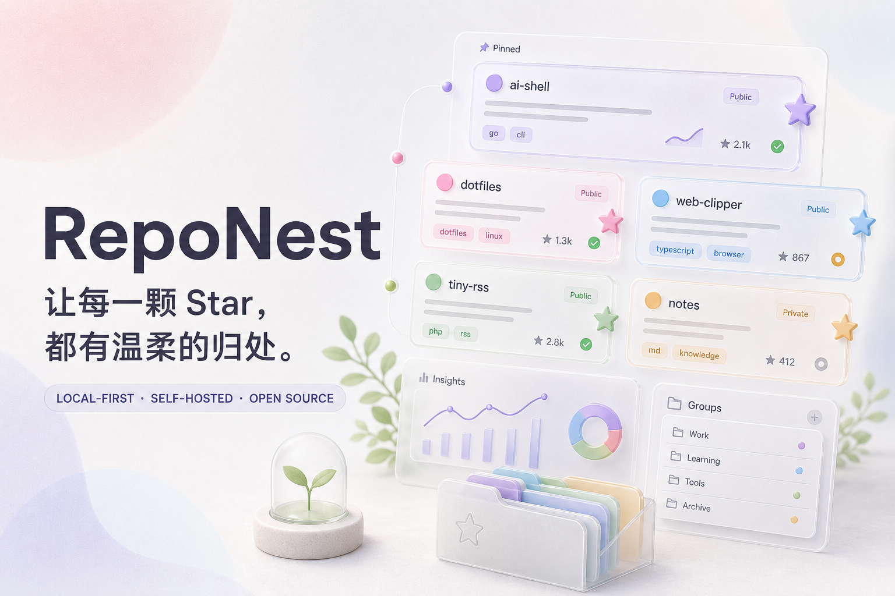

<div align="center">
  

  <h1>RepoNest</h1>

  <p><strong>让每一颗 Star，都有安静的归处。</strong></p>
  <p>GitHub 自动同步 · 收藏集与标签 · 单容器自托管 · 开源</p>

  <p>
    <a href="https://github.com/Elainaicey/RepoNest/actions/workflows/ci.yml"></a>
    <a href="https://github.com/Elainaicey/RepoNest/pkgs/container/reponest"></a>
    
    <a href="./LICENSE"></a>
  </p>
</div>

---

RepoNest 是一个面向开发者的综合性 GitHub 收藏管理器。它通过 GitHub App OAuth 登录并自动同步星标，再用收藏集、多标签、处理状态、评分、笔记、批量操作和洞察，把散落的项目整理成可以长期维护的个人技术资料库。

> [!IMPORTANT]
> 当前版本为 `0.1.0`，仍处于积极开发阶段，暂不创建正式 GitHub Release。

## 功能

- GitHub App OAuth 登录，支持 PKCE、state 校验和 HttpOnly 会话 Cookie
- 登录后立即同步 GitHub 星标，定时全量核对并提供互斥、状态反馈与截断保护
- GitHub 短期令牌自动刷新；访问令牌使用 AES-256-GCM 加密保存
- 收藏集与多标签组织，支持待整理、探索中、已采用三种处理状态
- 特别关注、归档、五星评分、私人笔记和最近打开记录
- 全局仓库搜索与 URL 化资料库筛选，支持分享、返回、排序及卡片/列表视图
- 分页加载、真实总数与独立语言筛选，数千条 Star 也不会一次性渲染
- 批量移动收藏集、修改状态、特别关注、归档和安全的增量标签调整
- 语言、状态与标签洞察，帮助发现收藏结构和待整理积压
- 手动收藏 GitHub 仓库和完整 JSON 数据导出
- 响应式多路由界面、移动端完整导航、命令面板、明暗主题与 Radix 色阶系统
- 单镜像、单容器、单端口部署，支持 `linux/amd64` 与 `linux/arm64`
- 宿主机可见数据目录、离线一致性备份、恢复回滚、健康诊断和日志轮转

## 架构

```text
Browser
   │
 Caddy · HTTPS
   │  127.0.0.1:3000
   ▼
┌──────────────────────── RepoNest container ────────────────────────┐
│  Unified gateway                                                   │
│       ├─ /        → Next.js / React / vinext                       │
│       └─ /api/*   → Fastify / GitHub OAuth / synchronization       │
│                                      │                              │
│                             Embedded PostgreSQL                    │
│                             /data/database                         │
└──────────────────────────────────────┼──────────────────────────────┘
                                       └─ GitHub REST API
```

前端和后端在源码中保持清晰分层，但生产环境统一构建为 `ghcr.io/elainaicey/reponest`。数据库使用 [PGlite](https://pglite.dev/) 在 Node.js 内嵌运行，无需额外数据库服务，因此整套应用只运行一个 Docker 容器。

## Debian / Ubuntu 部署

### 1. 创建 GitHub App

打开 GitHub **Settings → Developer settings → GitHub Apps → New GitHub App**：

| 字段 | 示例 |
| --- | --- |
| Homepage URL | `https://reponest.ushio.cc` |
| Callback URL | `https://reponest.ushio.cc/api/auth/github/callback` |
| Webhook | 关闭 |
| User permissions → Starring | Read-only |

生成 Client secret，并记下 GitHub App 的 Client ID 与 Client secret。

### 2. 安装

```bash
sudo apt update
sudo apt install -y ca-certificates curl openssl

curl -fsSL \
  https://raw.githubusercontent.com/Elainaicey/RepoNest/main/deploy/install.sh \
  -o /tmp/reponest-install.sh
less /tmp/reponest-install.sh
sudo sh /tmp/reponest-install.sh
sudo nano /opt/reponest/.env
```

安装目录：

```text
/opt/reponest/
├── docker-compose.yml
├── .env
├── .reponest-install     # 安装目录标识
├── reponestctl
├── Caddyfile.example
├── DEPLOYMENT.md
├── data/
│   └── database/          # 全部持久数据
└── backups/              # 压缩备份和校验文件
```

编辑 `.env`：

```env
REPONEST_VERSION=latest
REPONEST_PORT=3000
REPONEST_DATA_DIR=./data

PUBLIC_URL=https://reponest.ushio.cc
GITHUB_CLIENT_ID=你的_Client_ID
GITHUB_CLIENT_SECRET=你的_Client_secret
TOKEN_ENCRYPTION_KEY=使用下方命令生成
OWNER_GITHUB_LOGIN=你的_GitHub_用户名
```

`OWNER_GITHUB_LOGIN` 对个人公开实例强烈推荐。设置后，只有该 GitHub
账户能够通过 OAuth 进入 RepoNest；用户名匹配不区分大小写。不设置时，
任何能够授权该 GitHub App 的用户都可以创建自己的隔离空间。

生成令牌加密密钥：

```bash
openssl rand -base64 32
```

### 3. 启动

```bash
cd /opt/reponest
sudo ./reponestctl start
sudo ./reponestctl doctor
```

也可以直接使用标准 Docker Compose：

```bash
sudo docker compose pull
sudo docker compose up -d --remove-orphans
```

`docker compose ps` 应只显示一个名为 `reponest` 的容器。

### 4. Caddy 反向代理

```caddyfile
reponest.ushio.cc {
    encode zstd gzip
    reverse_proxy 127.0.0.1:3000
}
```

```bash
sudo caddy validate --config /etc/caddy/Caddyfile
sudo systemctl reload caddy
```

确保域名 A/AAAA 记录指向 VPS，并开放 80/443 端口。

## 运维

推荐更新方式：

```bash
cd /opt/reponest
sudo ./reponestctl update latest
```

管理工具会在更新前停止应用并创建一致性备份，然后拉取镜像、启动并执行健康检查。

```bash
sudo ./reponestctl status
sudo ./reponestctl logs
sudo ./reponestctl health
sudo ./reponestctl backup
sudo ./reponestctl restore backups/reponest-YYYYMMDDTHHMMSSZ.tar.gz
sudo ./reponestctl doctor
```

备份会产生短暂停机，以保证内嵌数据库文件处于一致状态。请把重要备份复制到另一台机器或对象存储；同一 VPS 上的备份无法防范整盘损坏。

## 本地开发

需要 Node.js 24，无需安装 PostgreSQL：

```bash
git clone https://github.com/Elainaicey/RepoNest.git
cd RepoNest
npm install
npm install --prefix server
cp .env.example .env
```

分别启动 Web 和 API；开发服务器会把 `/api` 自动转发到本地 API：

```bash
npm run dev
npm run dev:api
```

完整验证：

```bash
npm run lint
npm run typecheck
npm test
npm run test:api
docker build -t reponest:local .
```

## 技术栈

| 层级 | 技术 |
| --- | --- |
| Web | React 19、Next.js App Router、TypeScript、vinext、TanStack Query |
| UI | Radix Primitives、Lucide、CSS design tokens、Radix 色阶原则 |
| API | Fastify 5、Node.js 24、Zod |
| 身份 | GitHub App OAuth、PKCE、加密令牌、服务端会话 |
| 数据 | PGlite、PostgreSQL SQL、增量迁移 |
| 交付 | Docker Compose、GHCR、Caddy、GitHub Actions |

## 项目结构

```text
RepoNest/
├─ app/                    # 页面与路由
├─ components/             # 产品组件与交互
├─ lib/                    # Web API 客户端、类型与演示数据
├─ server/
│  ├─ migrations/         # 数据库结构迁移
│  ├─ src/                # OAuth、同步、会话与 REST API
│  └─ tests/              # API 与数据库测试
├─ deploy/                # 安装、管理、Caddy 与容器运行入口
├─ tests/                 # Web 与部署契约测试
├─ Dockerfile             # 唯一生产镜像
└─ docker-compose.yml     # 唯一生产服务
```

## 安全

- GitHub Client secret 和 `TOKEN_ENCRYPTION_KEY` 只能保存在 `.env`，不要提交到 Git。
- `TOKEN_ENCRYPTION_KEY` 丢失后，数据库中的 GitHub 令牌无法解密，请单独安全备份。
- OAuth 令牌不会发送到浏览器；数据库保存加密令牌，会话表只保存 Cookie 哈希。
- 个人实例建议设置 `OWNER_GITHUB_LOGIN`，在应用层限制可登录的 GitHub 账户。
- Compose 只监听 `127.0.0.1`，生产环境必须通过 HTTPS 反向代理访问。
- 漏洞报告方式见 [SECURITY.md](./SECURITY.md)。

## 路线图

- [x] `0.1.0` OAuth、同步、收藏集、标签、批量整理、洞察、多路由 UI 与单容器部署
- [ ] 可保存智能视图与浏览器书签导入
- [ ] 全文搜索、智能标签与相似项目发现
- [ ] Webhook、同步任务队列与管理员设置
- [ ] 稳定迁移策略、完整可观测性与正式 Release

## 参与贡献

请先阅读 [CONTRIBUTING.md](./CONTRIBUTING.md)。Bug、功能建议、文档改进和界面打磨都欢迎。

## License

[MIT](./LICENSE) © 2026 RepoNest contributors
