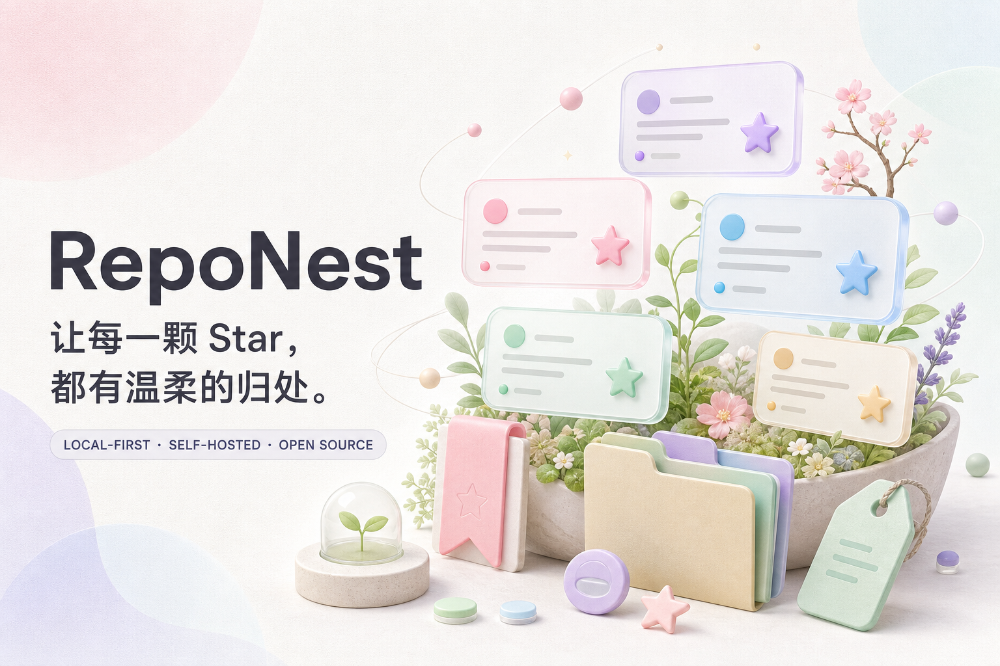

<div align="center">
  

  <h1>RepoNest</h1>

  <p><strong>让每一颗 Star，都有温柔的归处。</strong></p>
  <p>本地优先 · 清新好看 · Docker 一键部署 · 开源</p>

  <p>
    <a href="https://github.com/Elainaicey/RepoNest/actions/workflows/ci.yml"></a>
    <a href="https://github.com/Elainaicey/RepoNest/pkgs/container/reponest"></a>
    
    <a href="./LICENSE"></a>
    <a href="https://github.com/Elainaicey/RepoNest/stargazers"></a>
  </p>
</div>

---

RepoNest 是一个面向开发者的 GitHub Star 与综合收藏管理器。它把仓库、网页、标签、集合和私人笔记统一放进一个清新、安静、可以自托管的空间。

## 0.1.0 开发预览

- 分页同步最多 500 个 GitHub Star，并保留已有集合、标签与笔记
- 收藏 GitHub 仓库或任意网页，自动识别重复链接
- 同时搜索名称、描述、集合、标签和私人笔记
- 创建空集合，按集合、语言、最近更新、Star 数或名称筛选排序
- 批量特别关注、归档或移动到集合
- 在详情抽屉中增删标签、编辑笔记、移动集合
- JSON 完整备份与恢复，不包含 Token 等凭据
- 网格 / 列表视图、浅色 / 深色主题、移动端适配
- 本地优先存储，GitHub Token 只存在于当前页面内存
- `linux/amd64` 与 `linux/arm64` 多架构 GHCR 镜像

> [!IMPORTANT]
> RepoNest 仍在积极开发中，尚未正式发布。当前内部版本号保持为 0.1.0。它仍是单用户、本地优先版本，收藏数据保存在当前浏览器中，不会自动跨设备同步。建议定期使用「备份与恢复」导出 JSON。

## Docker Compose 一键部署

这是推荐的部署方式。Compose 会直接从 GHCR 拉取预构建镜像，不需要在 VPS 上下载源码或执行构建。

```bash
mkdir -p reponest && cd reponest
curl -fsSL https://raw.githubusercontent.com/Elainaicey/RepoNest/main/docker-compose.yml -o docker-compose.yml
docker compose pull
docker compose up -d
```

访问 `http://你的服务器IP:3000`。

### 自定义端口

创建 `.env`：

```env
REPONEST_VERSION=latest
REPONEST_PORT=8080
```

然后启动：

```bash
docker compose up -d
```

更新镜像：

```bash
docker compose pull
docker compose up -d
```

查看运行状态：

```bash
docker compose ps
docker compose logs -f --tail=100
```

## 从源码构建

如果你正在开发或希望自行构建镜像：

```bash
git clone https://github.com/Elainaicey/RepoNest.git
cd RepoNest
docker compose -f docker-compose.yml -f docker-compose.build.yml up -d --build
```

本地 Node.js 开发：

```bash
npm install
npm run dev
```

提交前运行：

```bash
npm run lint
npm test
```

## GitHub 同步

1. 在 GitHub 打开 **Settings → Developer settings → Personal access tokens → Fine-grained tokens**。
2. 创建只读 Token。同步公开 Star 不需要仓库写权限。
3. 在 RepoNest 点击「同步 GitHub」，粘贴 Token 并开始同步。

Token 不会写入 `localStorage`、Cookie 或服务端文件；刷新或关闭页面后即清除。RepoNest 最多读取五页、共 500 个 Star。

## 数据与隐私

| 数据 | 存储位置 | 说明 |
| --- | --- | --- |
| 收藏、集合、标签、笔记 | 浏览器 `localStorage` | 不上传到 RepoNest 服务端 |
| GitHub Token | 当前页面内存 | 刷新或关闭后清除 |
| GitHub 公开仓库信息 | GitHub REST API | 仅在同步或添加时请求 |
| JSON 备份 | 用户主动下载的位置 | 不包含 Token |
| 主题与同步时间 | 浏览器 `localStorage` | 仅用于本机体验 |

## VPS 反向代理

生产环境建议使用 Caddy、Nginx 或 Traefik，并启用 HTTPS：

```nginx
server {
    listen 80;
    server_name stars.example.com;

    location / {
        proxy_pass http://127.0.0.1:3000;
        proxy_set_header Host $host;
        proxy_set_header X-Forwarded-Host $host;
        proxy_set_header X-Forwarded-Proto $scheme;
        proxy_set_header X-Forwarded-For $proxy_add_x_forwarded_for;
    }
}
```

## 技术栈

- React 19 + TypeScript
- Next.js 兼容 App Router，由 [vinext](https://github.com/cloudflare/vinext) 构建
- Vite + Tailwind CSS 4
- Lucide 图标
- Node.js standalone 生产服务
- Docker 多阶段构建 + GitHub Container Registry

## 项目结构

```text
RepoNest/
├─ app/
│  ├─ RepoNestApp.tsx       # 产品功能、状态与 GitHub 同步
│  ├─ globals.css           # 清新浅色设计系统与响应式样式
│  ├─ layout.tsx            # SEO / Open Graph
│  └─ page.tsx
├─ public/og.png
├─ tests/
├─ .github/workflows/
│  ├─ ci.yml                # 代码、构建与容器验证
│  └─ docker-publish.yml    # GHCR 多架构镜像发布
├─ Dockerfile
├─ docker-compose.yml       # 直接拉取预构建镜像
└─ docker-compose.build.yml # 本地源码构建覆盖
```

## 路线图

- [ ] `0.1` 完成本地优先管理、GitHub 同步、批量操作、备份恢复与正式发布准备
- [ ] `0.2` Netscape Bookmark 导入、重复项中心、批量标签
- [ ] `0.3` SQLite / PostgreSQL 持久化与多设备同步
- [ ] `0.4` GitHub OAuth、定时同步与 Webhook
- [ ] `0.5` README 全文索引、智能标签与相似项目发现
- [ ] `1.0` 多用户、权限与完整备份恢复

## 参与贡献

请先阅读 [CONTRIBUTING.md](./CONTRIBUTING.md)。Bug、功能建议、文档改进和界面打磨都很欢迎。

## License

[MIT](./LICENSE) © 2026 RepoNest contributors
